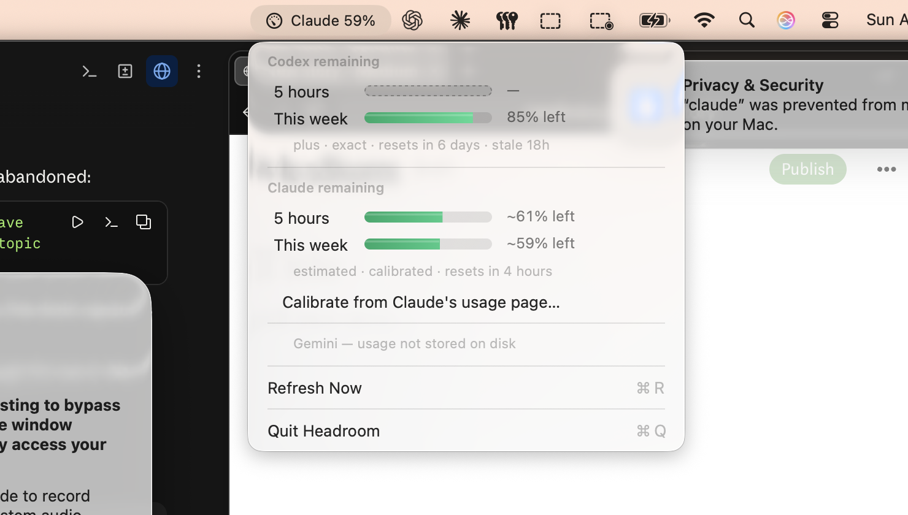

# Headroom

How much AI quota you have left, in your macOS menu bar.

A gauge needle shows the agent you're currently using; click it for per-agent
detail with animated drain capsules. It reads only the logs those tools already
write to your disk — **no network, no credentials, no API keys, and it consumes
none of your tokens.**

Requires macOS 14+.



## Install

Download `Headroom.dmg` from [Releases](../../releases), drag it to Applications,
and launch. It's a menu bar app — no Dock icon. Signed and notarized, with
tickets stapled to both the DMG and the app, so it installs offline.

## Agent support

| Agent | Source | Accuracy |
| --- | --- | --- |
| **Codex** | `~/.codex/sessions/**/rollout-*.jsonl` | **exact** — the server computes `used_percent` and Codex writes it down |
| **Claude** | `~/.claude/projects/**/*.jsonl` | **estimated** — a weighted token ledger divided by a capacity you calibrate |
| **Gemini** | — | **none** — see below |

Everything the UI shows reads as **remaining**. "73% left" means 73% left.

### Why Claude needs calibrating and Codex doesn't

Codex reports the same percentage the server enforces, so there is nothing to
estimate and nothing to calibrate.

Claude Code logs exact per-message token counts and never logs the limit those
counts are measured against. So Headroom computes a numerator and has to learn
the denominator. Run **Calibrate from Claude's usage page…** once: open
Claude → Settings → Usage, enter the two "% used" figures, and set the weekly
reset day and hour to match the "Resets …" line shown there.

Calibrating also captures usage from claude.ai and the Claude desktop app. Those
share your plan limit but never appear in the local Claude Code logs, so they are
an irreducible blind spot between calibrations.

### Why Gemini shows nothing

Both Google apps *display* quota and neither *stores* it — verified rather than
assumed. Antigravity's `state.vscdb` has one quota-shaped key, `modelCredits`,
which decodes to credit sentinels rather than percentages. The Gemini desktop app
keeps no LocalStorage or IndexedDB, and its URL cache holds only fonts. Both panes
carry a refresh button and an "Updated just now" line: the numbers are fetched
live per view.

Reading them would mean calling Google's endpoint with your OAuth token. This
project doesn't do that for Claude and doesn't do it here either.

Agents that are detected but unreadable get one explanatory line in the menu, so
a missing agent reads as "looked for, here's why" rather than as a bug.

## Build

```bash
./scripts/bundle.sh
```

```bash
./scripts/release.sh
```

```bash
./scripts/release.sh notarize
```

```bash
./.build/release/Headroom --probe
```

`bundle.sh` makes an unsigned `.app` for local development; `release.sh` signs and
packages one. `--probe` prints what the providers can actually see and exits —
when a vendor changes a log format, that's the fastest way to find out what broke.

## Architecture

| File | Role |
| --- | --- |
| `Model/Reading.swift` | the `Reading` enum — the epistemics of a number |
| `Providers/CodexProvider.swift` | reverse-tail parser (authoritative) |
| `Providers/ClaudeProvider.swift` | incremental token ledger (estimated) |
| `Providers/Calibration.swift` | learns the limit Claude never writes down |
| `Providers/GeminiProvider.swift` | honest detection, no invented numbers |
| `Watch/FileWatcher.swift` | one shared FSEvents stream |
| `Render/MenuRowView.swift` | the animated drain capsule |
| `App/AppDelegate.swift` | status item, menu, calibration sheet |

### Why `Reading` is not a `Double`

Codex hands you a server-computed percentage. Claude hands you raw token counts
and hides the denominator. Collapsing both into one `percent: Double` forces you
to invent numbers for Claude, which is how tools like this end up lying. A reading
is `.authoritative`, `.estimated` (with a confidence), or `.unavailable` — and the
UI always makes clear which it is showing.

## Things learned the hard way

Every one of these was a real bug found by running against live data, not a
hypothetical:

1. **Claude Code's JSONL is not chronological.** Measured on real transcripts, 86%
   of records arrive out of order with backward jumps of up to 21 hours, because
   sidechains, resumed sessions and compaction all interleave. An earlier version
   binary-searched by timestamp on the assumption that an append-only log is
   ordered; it landed near EOF and under-counted the weekly total by 4.5x. Read
   each file once, then only the bytes appended since.
2. **Codex emits two shapes of `rate_limits`.** `limit_id: "codex"` carries the
   percentages; `limit_id: "premium"` carries credits and leaves `primary` null.
   Taking the last `token_count` event shows an empty gauge about half the time.
   Scan backward for the last event with a non-null `primary`.
3. **An expired `resetsAt` is worse than no data.** These logs only advance while
   the tool runs. Once the reset passes, a cached "100%" tells someone with a
   fresh window that they're blocked. Report the reset instead.
4. **The 5-hour limit is a session window, not a rolling one.** It opens on your
   first message and runs five hours. Reconstructing the blocks and checking the
   inferred reset against Claude's own countdown agreed to within four minutes.
5. **The weekly limit is a fixed calendar window** ("Resets Fri 6:00 AM"), so the
   reset day and hour decide which days get summed. It's configurable for exactly
   that reason.
6. **Debouncing isn't enough while an agent is running.** Its log is written
   continuously, so a 400 ms debounce still fired several times a second at ~75 ms
   per scan — 17% of a core, measured. A hard floor between scans drops it to 0%.
   The gauge may lag a few seconds; it may not spin your fans.
7. **Everything shows *remaining*, never *used*.** A capsule once filled to
   "remaining" beside a label reading "used" — two contradictory statements at
   once, with no way for the reader to tell which. `Reading` exposes
   `percentUsed` and `percentRemaining` separately and only the latter is shown.
8. **AppKit disables menu items that have no action**, so a menu full of data rows
   renders entirely greyed out. `menu.autoenablesItems = false`.
9. **`Calendar(identifier:)` with a nil locale silently returns abbreviated
   weekday symbols** ("Fri"), which reads as a clipped label. `Calendar.current`
   returns full names.
10. **Anaconda ships its own `codesign`** that shadows Apple's on `PATH` and fails
    with "arguments were not expected". The release script calls the system tools
    by absolute path.
11. **Stapling only the DMG isn't enough.** `spctl` passes the app via an *online*
    lookup, but once dragged to `/Applications` it carries no ticket of its own, so
    a first launch offline can hang. Notarise and staple the `.app` first, then
    build the DMG around it.

## Distribution

`scripts/release.sh` builds, signs with Developer ID, hardens the runtime, adds a
secure timestamp, and produces a drag-to-Applications `.dmg`.

The signing identity is auto-detected when your keychain holds exactly one
`Developer ID Application` certificate. Override with `HEADROOM_IDENTITY` when you
have several.

Notarisation needs an App Store Connect credential in your keychain. Create it
once — it takes your Apple ID and an app-specific password, and nothing in this
repo ever sees either:

```bash
xcrun notarytool store-credentials "Headroom" --apple-id "you@example.com" --team-id "YOURTEAMID"
```

### Why not the Mac App Store

The App Store requires App Sandbox, and a sandboxed process cannot read
`~/.claude`, `~/.codex` or `~/.gemini` — which is the entire app. The only
sandbox-legal route is `NSOpenPanel` plus security-scoped bookmarks, meaning the
user hand-grants three hidden dotfolders on first run and re-grants them when the
bookmarks go stale. Developer ID is the correct channel for a tool like this, not
a fallback.

## Known limitations

- **Claude's figure is an estimate.** The weighting of cache reads, cache writes,
  output tokens and model tier is not published, so the proxy drifts as the token
  mix changes. Recalibrate now and then.
- **claude.ai and the Claude desktop app are invisible** to the local logs but
  share your plan limit.
- **Log formats are undocumented** and can change without notice. Every parse is
  fallible and degrades to "unavailable" rather than to a wrong number.
- **Not sandboxed**, necessarily. If your Mac is under MDM restricting
  non-App-Store apps, that's a separate gate.

## `Attic/`

Working, verified code the current design doesn't use — a notch-adjacent `NSPanel`
at CGWindow layer 25 (the layer Control Center's own items occupy), its placement
and contested-space arbitration, and a stacked multi-agent capsule renderer. It is
not compiled. It was dropped for design reasons, not because it was broken; the
comments explain what each piece solved.

## License

MIT — see [LICENSE](LICENSE).
